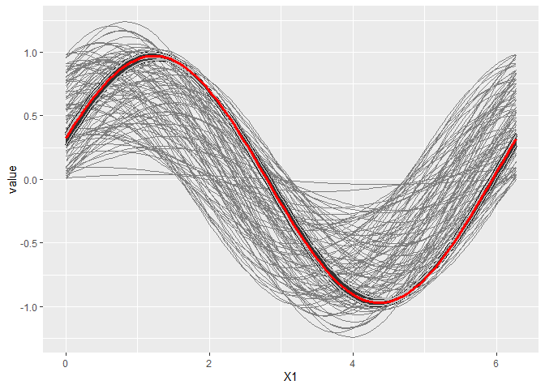
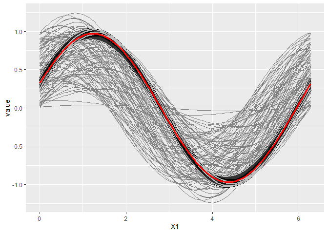
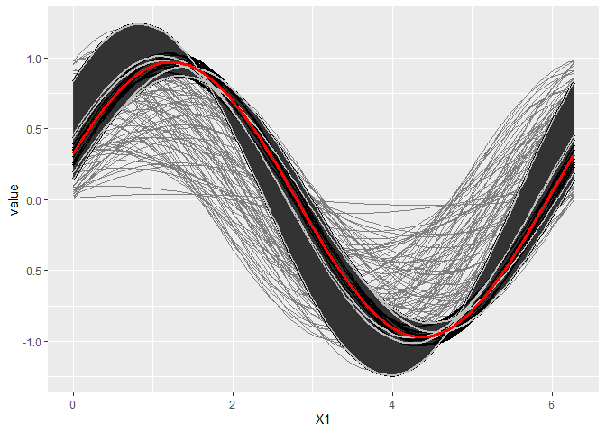
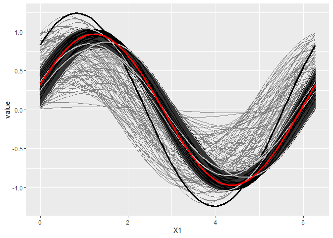
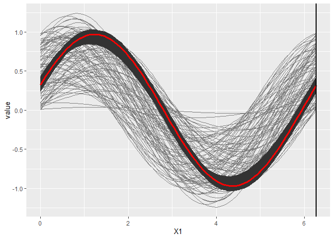

[](https://www.gnu.org/licenses/gpl-3.0)

Depth-based prediction bands for functional data
================================================

Enveloping without prediction or forecasting
--------------------------------------------



    ## Press <Enter> to continue...



    ## Press <Enter> to continue...



    ## Press <Enter> to continue...



    ## Press <Enter> to continue...

    ## $subsample
    ##  [1] "1"  "43" "29" "84" "22" "88" "28" "52" "63" "15" "41" "86" "97" "4"  "46"
    ## [16] "79" "14" "10"

Curve Extension
---------------

    ## Registered S3 method overwritten by 'xts':
    ##   method     from
    ##   as.zoo.xts zoo

    ## Registered S3 method overwritten by 'quantmod':
    ##   method            from
    ##   as.zoo.data.frame zoo

    ## Registered S3 methods overwritten by 'forecast':
    ##   method             from    
    ##   fitted.fracdiff    fracdiff
    ##   residuals.fracdiff fracdiff



To explore different values of cut and kcurves (only running in Rstudio)
------------------------------------------------------------------------

``` r
manipulate(
  {
  plotBand(data, cut, results$Jordered, kcurves, focal)
  },
  kcurves = slider(min = 1, max = length(results$Jordered), step = 1, ticks = TRUE),
  cut = slider(1, 99, initial = 50, step = 1)
)
```
