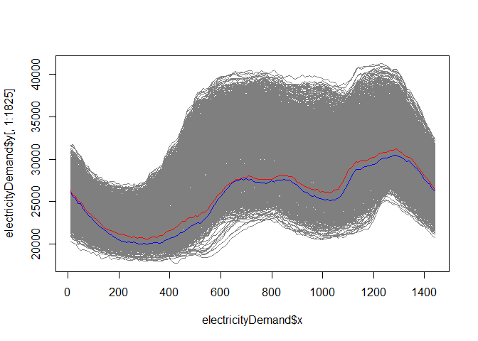
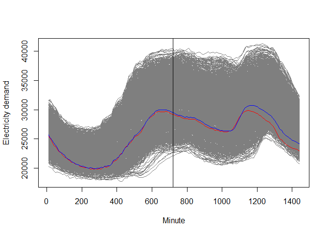

[](https://www.gnu.org/licenses/gpl-3.0)

On Projection Methods for Functional Time Series Forecasting
============================================================

Enveloping without prediction or forecasting
--------------------------------------------

``` r
data(sinedata)
focal <- '1'
dist <- 'l2' # dist<-'supremum'
plot <- TRUE

resultsBand <- envelope(sinedata, focal, dist, plot)
```


    ## Press <Enter> to continue...


    ## Press <Enter> to continue...


    ## Press <Enter> to continue...


    ## Press <Enter> to continue...

``` r
resultsBand #Envelope 
```

    ## $Jordered
    ##  [1] "1"  "43" "29" "84" "22" "88" "28" "52" "63" "15" "41" "86" "97" "4"  "46"
    ## [16] "79" "14" "10"

Curve Extension
---------------

``` r
kcurves <- 10 # number of curves of the envelope involved in the band

dataPartially <- rainbow::fds(sinedata$x[1:25], sinedata$y[1:25,])
results <- envelope(dataPartially, focal, dist, plot = FALSE)

pl <- plotBand(sinedata, focal, results$Jordered, kcurves, cut = 25)
```


To explore different values of cut and kcurves (only running in Rstudio)
------------------------------------------------------------------------

``` r
manipulate(
  {
  plotBand(sinedata, focal, results$Jordered, kcurves)
  },
  kcurves = slider(min = 1, max = length(results$Jordered), step = 1, ticks = TRUE),
  cut = slider(1, 99, initial = 50, step = 1)
)
```

Spanish Electricity Demand Example
----------------------------------

### Envelope forecast

``` r
data(electricityDemand)
focal <- "saturday/29/12/2018"
data <- rainbow::fts(electricityDemand$x, electricityDemand$y[,1:1825])
point <- envelope.forecast(data, focal, h = 1, distance = "l2", typePoint = "expw", theta = 1)

plot(data, col = "grey50")
lines(data$x, point, col = "red")
lines(electricityDemand$x, electricityDemand$y[,"sunday/30/12/2018"], col = "blue")
```



``` r
data(electricityDemand)
# DU half day
focal <- "monday/31/12/2018"
data <- electricityDemand
data$y[72:144, focal] <- NA
point <- envelope.forecast(data, focal, h = 1, distance = "l2", typePoint = "expw", theta = 1)

plot(data, col = "grey50")
lines(data$x, point, col = "red")
lines(data$x, electricityDemand$y[,"monday/31/12/2018"], col = "blue")
abline(v = data$x[72])
```



### Functional kNearest neighbour forecast

``` r
data(electricityDemand)
focal <- "saturday/29/12/2018"
data <- rainbow::fts(electricityDemand$x, electricityDemand$y[,1:1825])
point <- fknn.forecast(data, focal, k = 3, h = 1, distance = "l2", typePoint = "expw", theta = 1)

plot(data, col = "grey50")
lines(data$x, point, col = "red")
lines(electricityDemand$x, electricityDemand$y[,"sunday/30/12/2018"], col = "blue")
```


``` r
data(electricityDemand)
# DU half day
focal <- "monday/31/12/2018"
data <- electricityDemand
data$y[72:144, focal] <- NA
point <- fknn.forecast(data, focal, k = 3, h = 1, distance = "l2", typePoint = "expw", theta = 1)

plot(data, col = "grey50")
lines(data$x, point, col = "red")
lines(data$x, electricityDemand$y[,"monday/31/12/2018"], col = "blue")
abline(v = data$x[72])
```


